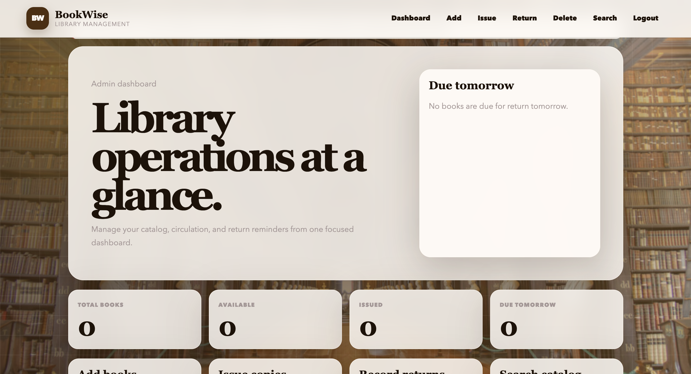

# Library Management System

A Flask and MySQL web app for managing a small library catalog. It supports
admin catalog operations, book issue/return workflows, public catalog search,
dashboard statistics, and return reminders.

## Features

- Admin login with session-based access for management pages.
- Public catalog search by accession number, serial number, title, or author.
- Add and delete book records.
- Issue books using accession number; the app pulls title and author from the catalog.
- Return books using accession number; the app archives the issue record and marks the book available.
- Dashboard totals for total, available, issued, and due-tomorrow books.
- Shared responsive UI with reusable templates and flash messages.

## Tech Stack

- Python
- Flask
- MySQL
- HTML and CSS

## Setup

1. Create and activate a virtual environment.

```bash
python3 -m venv .venv
source .venv/bin/activate
```

2. Install dependencies.

```bash
pip install -r requirements.txt
```

3. Configure environment variables if your values differ from the defaults.

```bash
export FLASK_SECRET_KEY="change-me"
export ADMIN_USERNAME="admin"
export ADMIN_PASSWORD="pass"
export DB_HOST="localhost"
export DB_USER="root"
export DB_PASSWORD="pwd"
export DB_NAME="db_name"
export LOAN_DAYS="14"
```

4. Create the database tables if you do not already have them.

```bash
mysql -u root -p < schema.sql
```

5. Run the app.

```bash
python app.py
```

Open `http://localhost:8000`.

## Database Tables

The app expects MySQL tables named `book`, `issue`, and `returnb`. A matching
starter schema is included in `schema.sql`. The current code uses these columns:

- `book`: `SL.NO`, `A/c No`, `Title`, `Author`, `Edition/Year`, `Publication`, `Issue_status`, `return_date`
- `issue`: `Student_Name`, `Reg_no`, `AC_No`, `Title`, `Author`, `Issue_Date`
- `returnb`: `Student_Name`, `Reg_no`, `AC_No`, `Title`, `Author`, `Return_Date`

## Web App

